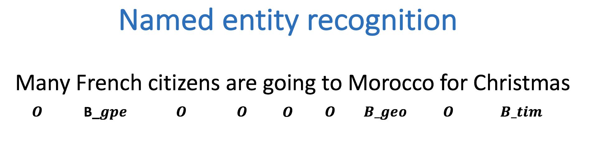
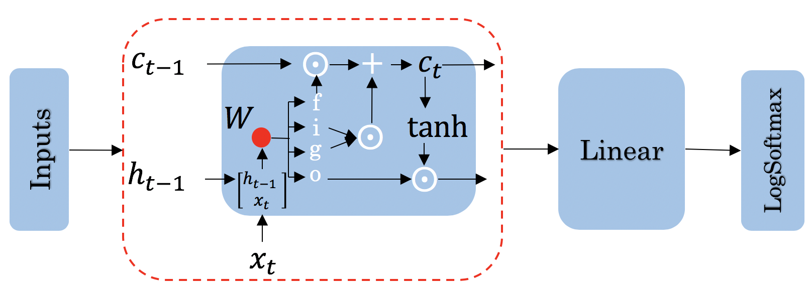

<a id="readme-top"></a>

<br />
<div align="center">
  <h3 align="center">Named Entity Recognition</h3>

  <p align="center">
    Predicting named entities in Text File
    <br />
    <a href="https://github.com/Arnav6508/Named-Entity-Recognition"><strong>Explore the docs »</strong></a>
    <br />
  </p>
</div>


<!-- TABLE OF CONTENTS -->
<details>
  <summary>Table of Contents</summary>
  <ol>
    <li><a href="#about-the-project">About The Project</a>
    <li><a href="#methodology">Methodologya</a></li>
    <li><a href="#future-goals">Future Goals</a></li>
    <li>
      <a href="#getting-started">Getting Started</a>
      <ul>
        <li><a href="#installation">Installation</a></li>
      </ul>
    </li>
    <li><a href="#contributing">Contributing</a></li>
    <li><a href="#license">License</a></li>
    <li><a href="#contact">Contact</a></li>
  </ol>
</details>


<!-- ABOUT THE PROJECT -->
## About The Project

Let's begin by defining what a Named Entity Recognition (NER) is. NER is a subtask of information extraction that locates and classifies named entities in a text. The named entities could be organizations, persons, locations, times, etc.

For example:




Labelling aid:

<ul><b>French</b>: geopolitical entity</ul>
<ul><b>Morocco</b>: geographic entity</ul>
<ul><b>Christmas</b>: time indicator</ul>

Everything else that is labeled with an O is not considered to be a named entity. 


## Methodology

The methodology follows a sequence-to-sequence modeling approach with the use of Long Short-Term Memory (LSTM) networks for robust context understanding. Below is an outline of the steps:

1. <b>Data Preprocessing</b>
-> Tokenization: Input text is split into tokens (words or subwords).
-> Label Encoding: Each token is annotated with a corresponding entity label (e.g., B-PER, I-PER, O).
-> Padding: Sequences are padded to a uniform length to ensure compatibility with the LSTM input format.

2. <b>Model Architecture</b>
-> Embedding Layer: Converts tokens into dense vectors, capturing semantic meaning.
-> Bidirectional LSTM Layer: Processes the token sequences while maintaining contextual information from both previous tokens and future tokens.
-> Dropout Layer: Applied to prevent overfitting by randomly zeroing some of the layer outputs during training.
-> Dense Layer: Maps the LSTM output to entity classes for each token.
-> Activation Function: A softmax function is used for multiclass classification, producing probabilities for each entity label.



3. <b>Training</b>
-> Loss Function: The sparse categorical cross-entropy loss is minimized to optimize the model for multiclass classification.
-> Optimizer: Adam optimizer is used for faster convergence.
-> Validation: A portion of the dataset is reserved for validation to monitor overfitting and performance.
4. <b>Inference</b>
-> The trained model is used to predict entity labels for unseen text.
-> Predicted labels are mapped back to the original text tokens for interpretability.

This structured approach ensures the model is robust and effective in recognizing named entities achieivng <b>96.55% accuracy</b> on test set.

Special thanks to <b>Debasis Samal</b> Kaggle user whose open-source dataset I have used. URL of dataset: https://www.kaggle.com/datasets/debasisdotcom/name-entity-recognition-ner-dataset

## Future Goals

These are the updates I am looking forward to make in this repository:

-> A separate preprocess file for processing the sentences passed in the inference file since the dataset was already preprocessed.

-> Utilise Part-of-speech and pre-trained word embeddings in the model for even better accuracy.

-> Deploy the repository with a proper frontend 😍


<!-- GETTING STARTED -->
## Getting Started

To use the project locally, you can start by creating your own model by using build_model function in model.py!<br>
For inference, just utilise the predict function in inference.py for testing on personal data. There is also test_accuracy function in the file to calculate accuracy on any unseen data.


### Installation

_Below is an example of how you can instruct your audience on installing and setting up your app._

1. Clone the repo
   ```sh
   git clone https://github.com/Arnav6508/Named-Entity-Recognition
   ```

2. Change git remote url to avoid accidental pushes to base project
   ```sh
   git remote set-url origin github_username/repo_name
   git remote -v # confirm the changes
   ```


<!-- CONTRIBUTING -->
## Contributing

Contributions are what make the open source community such an amazing place to learn, inspire, and create. Any contributions you make are **greatly appreciated**.

If you have a suggestion that would make this better, please fork the repo and create a pull request. You can also simply open an issue with the tag "enhancement".
Don't forget to give the project a star! Thanks again!

1. Fork the Project
2. Create your Feature Branch (`git checkout -b feature/AmazingFeature`)
3. Commit your Changes (`git commit -m 'Add some AmazingFeature'`)
4. Push to the Branch (`git push origin feature/AmazingFeature`)
5. Open a Pull Request


<!-- LICENSE -->
## License

Distributed under the MIT License. See `LICENSE.txt` for more information.


<!-- CONTACT -->
## Contact

Email -  arnavgupta6508@gmail.com


<p align="right">(<a href="#readme-top">back to top</a>)</p>

